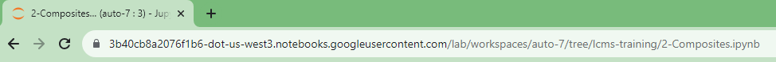
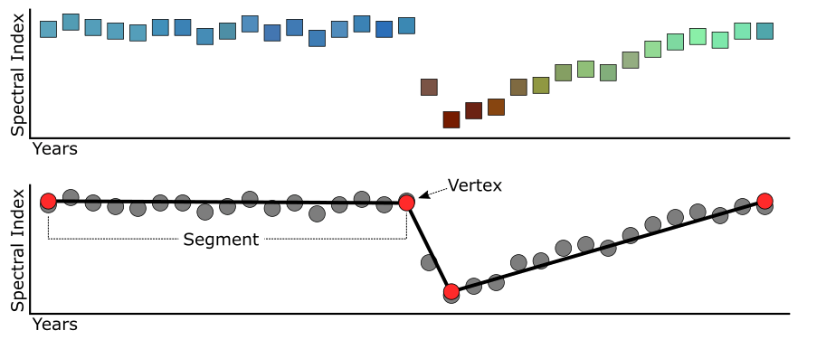
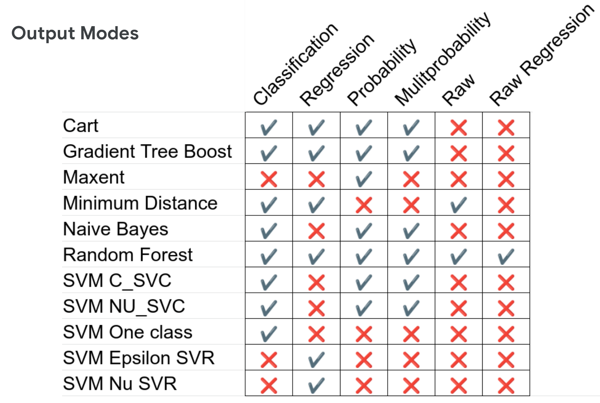
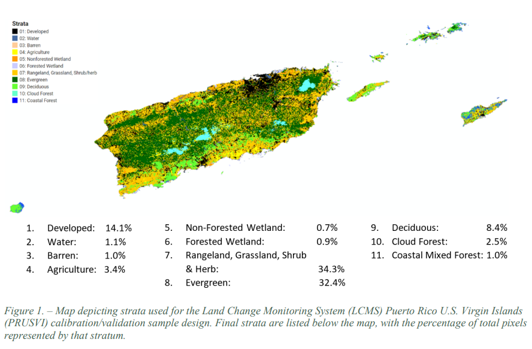

#  LCMS Training

Notebooks to accompany the Google QwikLabs Landscape Change Monitoring System (LCMS) Learning Track

## Description

These notebooks are intended to be used as part of the Google Qwiklabs LCMS Learning Track. They are designed to run in **Vertex AI Workbench** but are also compatible with **Google Colab**. Together, they walk through the complete end-to-end workflow for producing LCMS land change, land cover, and land use outputs using Google Earth Engine (GEE) and the [geeViz](https://pypi.org/project/geeViz/) Python library.

> **Tip:** Each notebook requires a `workbench_url` to be set before running. Copy the base URL from your browser's address bar in Vertex AI Workbench.
>
> 

---

## Notebook Outline

| Lab | Notebook | Topics |
|-----|----------|--------|
| 2 | [2-Composites.ipynb](2-Composites.ipynb) | Landsat & Sentinel-2 annual composites, cloud masking, TDOM |
| 3 | [3-LandTrendr_and_CCDC.ipynb](3-LandTrendr_and_CCDC.ipynb) | Temporal segmentation, change detection, CCDC harmonic modeling |
| 4 | [4-Training_Data_Setup.ipynb](4-Training_Data_Setup.ipynb) | TimeSync reference data, terrain variables, predictor extraction |
| 5 | [5-Model_Calibration_and_Application.ipynb](5-Model_Calibration_and_Application.ipynb) | Random Forest model calibration, variable selection, map application |
| 6 | [6-Map_Assemblage.ipynb](6-Map_Assemblage.ipynb) | Map assemblage, change thresholds, probability-based classification |
| 7 | [7-Map_Validation.ipynb](7-Map_Validation.ipynb) | K-fold cross-validation, confusion matrices, area-adjusted accuracy |
| 8 | [8-Export_and_Post_Processing.ipynb](8-Export_and_Post_Processing.ipynb) | COG export, color maps, VRT creation, Google Cloud Storage |

---

## Lab Descriptions

### Lab 2 — Create Landsat and Sentinel-2 Annual Composites
[2-Composites.ipynb](2-Composites.ipynb)

Introduces the compositing methods used by LCMS. Students build annual medoid composites for a small study area (Puerto Rico and the U.S. Virgin Islands) using the `getLandsatAndSentinel2HybridWrapper` function in geeViz.

**Key topics:**
- Setting study area, date range, and sensor parameters
- Fmask and cloudScore+ cloud masking
- Temporal Dark Outlier Mask (TDOM) for cloud shadow removal
- Optionally including Landsat 7 SLC-off data
- Exporting composites to Google Earth Engine image collections

---

### Lab 3 — LandTrendr and CCDC
[3-LandTrendr_and_CCDC.ipynb](3-LandTrendr_and_CCDC.ipynb)

Covers the two primary temporal change detection algorithms used as predictor inputs for LCMS models.

**LandTrendr** fits piecewise linear segments to annual spectral time series to identify the timing, duration, and magnitude of change events.

**Key topics:**
- Running LandTrendr on single and multi-band spectral indices
- Extracting loss year, loss magnitude, and fitted time series from LandTrendr arrays
- Tiling large study areas for memory-efficient processing
- Running CCDC on Landsat imagery
- Interpreting CCDC harmonic model coefficients and break detection
- Predicting synthetic composite values from CCDC over a full time series

---

### Lab 4 — LCMS Model Training Data Setup
[4-Training_Data_Setup.ipynb](4-Training_Data_Setup.ipynb)

Takes reference data from the TimeSync image interpretation tool and prepares it for model calibration by extracting annual LandTrendr, CCDC, and terrain predictor values at each plot location.

**Key topics:**
- Generating terrain variables (slope, aspect, hillshade) from SRTM
- Loading and exploring TimeSync reference plots
- Crosswalking named change/cover/use labels to numeric codes
- Annualizing LandTrendr and CCDC outputs
- Stacking predictor variables and extracting values at sample points
- Exporting training feature collections to GEE assets

---

### Lab 5 — Model Setup, Calibration, and Application
[5-Model_Calibration_and_Application.ipynb](5-Model_Calibration_and_Application.ipynb)

Downloads the training data exported in Lab 4 and uses scikit-learn to fit, evaluate, and compare Random Forest models for each LCMS output (Change, Land Cover, Land Use). The best-performing models are then applied spatially in GEE.

**Key topics:**
- Removing correlated predictor variables (|R| > 0.95)
- Fitting and evaluating sklearn Random Forest models
- Comparing local sklearn results against GEE's `ee.Classifier.smileRandomForest`
- Exploring GEE classifier output modes (Classification, Probability, Multiprobability, etc.)

  

- Applying trained models across annual predictor stacks
- Exporting raw model probability outputs

---

### Lab 6 — LCMS Map Assemblage
[6-Map_Assemblage.ipynb](6-Map_Assemblage.ipynb)

Takes the raw per-class probability outputs from Lab 5 and assembles them into final thematic map products using two approaches: highest-probability classification and threshold-based change assemblage.

**Key topics:**
- Highest-probability class selection for land cover and land use
- Using Random Forest to compute per-class probability thresholds that balance omission and commission error
- Applying change thresholds to assemble final change layers
- Creating single-class year summary layers (e.g., most recent loss year)
- Exporting fully assembled annual LCMS image stacks

---

### Lab 7 — LCMS Map Validation
[7-Map_Validation.ipynb](7-Map_Validation.ipynb)

Assesses the accuracy of assembled LCMS map products using k-fold cross-validation and area-adjusted accuracy estimation following Stehman (2014).

**Key topics:**
- K-fold cross-validation for balanced accuracy estimation
- Replicating change assemblage thresholds on held-out data
- Computing confusion matrices and per-class accuracy statistics
- Area-adjusted accuracy using stratified sample design weights
- Exporting accuracy results to Google Cloud Storage

  

---

### Lab 8 — Export and Post-Processing
[8-Export_and_Post_Processing.ipynb](8-Export_and_Post_Processing.ipynb)

Covers the final steps needed to deliver LCMS outputs as publication-ready, platform-agnostic rasters outside of GEE.

**Key topics:**
- Exporting assembled GEE image collections to Google Cloud Storage as Cloud Optimized GeoTIFFs (COGs)
- Building Virtual Raster Templates (VRTs) for tiled outputs
- Applying LCMS color maps and class names
- Setting no-data values, verifying projections, and computing pyramids
- Validating COG structure and moving final outputs back to Cloud Storage

---

## Getting Started

### Dependencies

* A Google Earth Engine account with access to a GEE Cloud Project
* A running Python notebook environment (Vertex AI Workbench recommended; Google Colab also supported)
* Python package dependencies are installed automatically when each notebook is run

### Running the Notebooks

Run notebooks in order (2 → 8). Each lab builds on assets exported by the previous lab. Pre-baked assets are available for most labs so you can start at any point in the series.

To toggle map layers in the interactive viewer, click the play button next to each layer:

---

## Help

Authentication to Google Earth Engine is always changing and may introduce bugs in the future. If you encounter authentication errors, re-run the GEE authentication cell or refer to the [geeViz documentation](https://pypi.org/project/geeViz/).

---

## Authors

* Ian Housman — ihousman@redcastleresources.com
* Lila Leatherman — lleatherman@redcastleresources.com

---

## License

This project is licensed under the Apache 2 License — see the [LICENSE](LICENSE) file for details.

---

## Additional Resources

* [geeViz](https://pypi.org/project/geeViz/)
* [geeViz Examples](https://github.com/gee-community/geeViz/tree/master/examples)
* [LandTrendr Training](https://emapr.github.io/LT-GEE/index.html)
* [LCMS Data Explorer](https://apps.fs.usda.gov/lcms-viewer)
* [LCMS Homepage](https://apps.fs.usda.gov/lcms-viewer/home.html)
* [LCMS Base Learner Explorer](https://apps.fs.usda.gov/lcms-viewer/lcms-base-learner.html)
